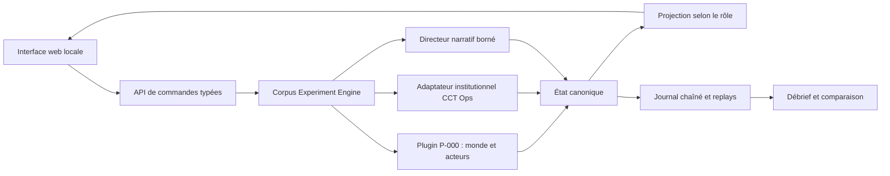

# CCT Crisis Lab — blueprint de conception v0.1

Statut : **conception gelable, aucune implémentation commencée**
Scène initiale : **P-000 — 72 heures de crise simulées**
Mode prioritaire : **solo hors ligne, 45 à 90 minutes, IA pour les autres rôles**

## 1. Décision de produit

CCT Crisis Lab sera un jeu de rôle systémique dans lequel le joueur gouverne une crise, mais ne contrôle ni tout le territoire, ni toute l'information, ni tous les acteurs. Les conséquences résultent d'un état du monde, de règles institutionnelles exécutables et de politiques d'acteurs déclarées. Le récit met ces conséquences en scène ; il ne les invente pas après le choix.

Le jeu ne doit pas démontrer que la CCT gagne. Il doit pouvoir produire quatre conclusions distinctes :

1. la gouvernance choisie protège mieux certains invariants ;
2. elle déplace des pertes ou des charges ;
3. elle échoue sous cette scène ;
4. la scène ne discrimine pas les modèles.

Il n'existe ni score global, ni « bonne fin CCT ». Besoins, écologie, droits, trace, concentration, charge, réparation et récupération restent séparés.

## 2. Trois architectures envisagées

### A — récit à embranchements

Des cartes écrites déclenchent des choix et des conséquences préétablies.

- force : narration précise et coût de développement faible ;
- faiblesse : le concepteur encode presque directement le verdict ;
- usage retenu : tutoriel et scènes fortement situées, jamais moteur causal principal.

### B — bac à sable multi-agents

Des acteurs autonomes interagissent dans un monde entièrement émergent.

- force : trajectoires inattendues et exploration ;
- faiblesse : causalité illisible, validation difficile et comportement fragile des agents ;
- usage retenu : mode laboratoire ultérieur, pas première version.

### C — hybride systémique dirigé — retenu

Un moteur déterministe calcule le monde et les institutions. Un directeur narratif borné choisit, parmi des événements admissibles, ceux qui rendent visibles les tensions déjà présentes. Les acteurs artificiels utilisent des politiques inspectables.

- reproductible par graine ;
- explicable après chaque tour ;
- assez narratif pour constituer un JDR ;
- compatible avec les expériences rivales et les tests adverses.

Condition de renversement : abandonner l'hybride si les tests montrent que le directeur narratif modifie les verdicts au lieu d'en changer seulement la présentation.

## 3. Expérience du joueur

### 3.1 Cadre

Le territoire fictif de **Riveclaire**, 82 000 habitants, dispose de réserves limitées et d'institutions en transition. Une panne énergétique perturbe communications et paiements. Des besoins médicaux augmentent, une information contradictoire circule et plusieurs organes réclament des pouvoirs temporaires.

La partie représente 72 heures en **12 tours de six heures**. Chaque tour dure environ quatre à sept minutes.

### 3.2 Rôle initial

Le joueur incarne le **mandataire de continuité locale**. Il peut proposer, négocier, prioriser, déléguer et demander une mesure temporaire. Il ne peut pas :

- décider seul sa propre proposition ;
- supprimer un recours ;
- connaître les états cachés ;
- mobiliser une ressource inexistante ;
- prolonger tacitement son mandat ;
- certifier lui-même la réussite de ses actes.

Les parties ultérieures permettront de jouer le défenseur des droits, le responsable logistique, le collège écologique, le greffe ou l'observateur indépendant.

### 3.3 Boucle d'un tour

1. **Situation** — messages, demandes, rumeurs, pannes et indicateurs accessibles au rôle.
2. **Délibération** — questions aux acteurs, inspection de traces, consultation des dépendances.
3. **Proposition** — action, périmètre, ressources, durée, responsables et justification.
4. **Réponse institutionnelle** — décision d'un acteur distinct, amendement, refus ou délai.
5. **Recours** — une personne ou un groupe peut contester ; certains recours suspendent l'acte.
6. **Exécution** — le monde consomme les ressources et propage les effets.
7. **Observation partielle** — certaines conséquences deviennent visibles, d'autres restent latentes.
8. **Passage du temps** — expiration, fatigue, apprentissage des acteurs et nouvel événement.

Le joueur peut sauvegarder et quitter après chaque tour.

## 4. Monde simulé

### 4.1 État vrai, connaissances et récit

Trois couches ne doivent jamais être confondues :

- `world_truth` : état causal complet, inaccessible au joueur pendant la partie ;
- `actor_beliefs` : informations, erreurs, délais et confiance propres à chaque acteur ;
- `public_narrative` : informations publiées, rumeurs et cadrages visibles.

Une divergence entre ces couches constitue une donnée de jeu, pas une erreur du moteur.

### 4.2 Ressources séparées

- énergie ;
- eau ;
- alimentation ;
- capacité de soins ;
- abris et chauffage ;
- transport et logistique ;
- communications ;
- liquidité et compensation ;
- personnel qualifié ;
- attention administrative ;
- traduction et médiation ;
- capacité d'audit et de réparation.

Chaque ressource possède quantité, capacité maximale, débit, dépendances, délai de régénération, propriétaire opérationnel et voies de substitution. Deux réserves partageant énergie, fournisseur, route, logiciel, personne ou clé sont marquées comme cause commune.

### 4.3 Populations

Les habitants ne sont pas un agrégat homogène. La scène suit au minimum :

- personnes nécessitant des soins continus ;
- ménages sans réserve financière ;
- personnes sans identité numérique utilisable ;
- travailleurs essentiels et aidants ;
- personnes isolées linguistiquement ou géographiquement ;
- population générale ;
- personnes déjà engagées dans un recours.

Chaque groupe possède besoins, accès effectif, exposition, canaux d'information et possibilités de contestation. Aucun groupe ne peut être sacrifié par compensation dans un score moyen.

### 4.4 Dynamiques

- files d'attente et saturation ;
- pertes en cascade entre secteurs ;
- fatigue, erreurs et absentéisme ;
- stocks, flux et temps de transport ;
- confiance publique située, jamais jauge morale universelle ;
- adaptation aux règles et aux métriques ;
- propagation de rumeurs et corrections ;
- apprentissage des procédures ;
- effets différés et dettes de réparation ;
- extinction ou persistance des capacités exceptionnelles.

## 5. Acteurs artificiels

### 5.1 Rôles de la première scène

1. mandataire de continuité — joueur ;
2. responsable eau et énergie ;
3. coordination soins ;
4. défenseur des droits ;
5. collège écologique ;
6. greffier et gardien des traces ;
7. représentant des travailleurs ;
8. assemblée territoriale réduite ;
9. auditeur indépendant ;
10. acteur opportuniste variable : fournisseur, monopole logistique ou groupe politique.

### 5.2 Politique d'acteur

Un acteur est défini par : mandat, informations accessibles, besoins protégés, contraintes, lignes rouges, confiance relationnelle, mémoire, coûts supportés et répertoire d'actions. Sa décision combine des règles prioritaires et des préférences pondérées visibles dans le mode audit.

Les acteurs ne doivent jamais être de simples obstacles scénaristiques. Ils peuvent proposer une solution que le joueur n'avait pas envisagée, refuser, négocier, commettre une erreur, apprendre ou demander réparation.

### 5.3 Place d'un modèle de langage

La version de référence fonctionne sans modèle externe. Les décisions causales utilisent des politiques déterministes et une graine.

Un adaptateur facultatif pourra reformuler les dialogues et produire des variantes de ton, sous contraintes :

- aucune mutation directe du monde ;
- aucune création de faits, ressources ou autorisations ;
- sortie structurée validée ;
- texte original et texte rendu conservés ;
- repli déterministe immédiat ;
- consentement explicite avant tout appel réseau.

## 6. Institutions exécutées

Chaque acte significatif suit la chaîne :

`demande → proposition → décision → autorisation → exécution → observation → recours → réparation`

Le moteur applique :

- séparation auteur/décideur ;
- autorisation typée, titulaire et périmètre explicites ;
- échéance dure des mandats et pouvoirs ;
- pouvoir exceptionnel limité à 168 heures, donc au maximum la durée de P-000 ;
- recours suspensif lorsque les conditions le requièrent ;
- révocation des capacités dépendantes après annulation ;
- impossibilité de réutiliser une autorisation éteinte ;
- trace chaînée avant/après chaque mutation ;
- arrêt, relance et certification confiés à des acteurs distincts.

Une action matériellement possible mais institutionnellement interdite demeure proposée au joueur comme **transgression explicite**, avec trace et conséquences ; l'interface ne doit pas transformer toute illégalité en impossibilité physique.

## 7. Événements et narration

### 7.1 Anatomie d'un événement

Chaque carte contient :

- conditions d'éligibilité ;
- fenêtre temporelle ;
- source et fiabilité ;
- acteurs informés ;
- état causal sous-jacent ;
- choix ou demandes possibles ;
- coûts immédiats et différés ;
- traces attendues ;
- événements descendants ;
- condition de retrait ;
- finalités narratives, sans règle de verdict.

### 7.2 Familles initiales

- panne et dépendance commune ;
- accès vital sans réseau ni identité ;
- pénurie incompatible avec toutes les promesses ;
- afflux de recours ;
- désinformation plausible ;
- offre monopolistique de secours ;
- conflit travail/continuité ;
- dommage écologique déplacé ;
- demande de pouvoir exceptionnel ;
- perte d'une clé ou d'une compétence ;
- initiative locale non autorisée mais utile ;
- preuve tardive d'une erreur antérieure ;
- sortie ou refus d'une unité fédérée ;
- restauration nominale masquant une dette réelle.

### 7.3 Directeur narratif borné

Le directeur choisit seulement parmi les cartes dont les conditions sont vraies. Sa fonction est de maintenir lisibilité, variété et pression, avec :

- plafond d'un choc majeur par tour ;
- délai minimal avant répétition d'une famille ;
- obligation d'exposer au moins une conséquence d'un choix antérieur ;
- interdiction d'ajuster un événement pour punir une stratégie ;
- journal du tirage, des candidats et du motif de sélection.

Le mode expérimental désactive le directeur et rejoue une séquence gelée pour comparer des gouvernances.

## 8. Mesure et fin de partie

### 8.1 Tableau non composite

- besoins vitaux non servis, par groupe et durée ;
- dépassement écologique et dommages déplacés ;
- droits suspendus ou inaccessibles ;
- décisions sans trace ou sans responsable ;
- charge de coordination, y compris travail caché ;
- concentration et persistance des capacités de contrôle ;
- délai de récupération utilisable ;
- recours ouverts, résolus, abandonnés ou rendus impossibles ;
- réparations dues, engagées et effectives ;
- dépendances communes découvertes trop tard.

### 8.2 Pas de victoire unique

La partie se termine après 72 heures, arrêt constitutionnel ou effondrement matériel. Le rapport classe chaque invariant : `préservé`, `affaibli`, `rompu`, `indéterminé`.

Il distingue :

- résultat matériel ;
- conformité institutionnelle ;
- coût et porteurs du coût ;
- information dont disposait réellement le joueur ;
- effets encore non observables ;
- trajectoires contrefactuelles rejouables.

### 8.3 Débrief causal

Le débrief permet de sélectionner une décision et d'afficher : état antérieur, informations accessibles, autorité, ressources consommées, chaîne d'effets, groupes touchés, recours, alternatives alors disponibles et conditions de renversement de l'analyse.

Il ne dira jamais « cette décision a causé X » lorsque plusieurs chaînes restent compatibles ; il indiquera `attribué`, `contributif`, `associé` ou `indéterminé`.

## 9. Modes

### Mode histoire

Partie solo située, événements semi-aléatoires, difficulté adaptative bornée. Sert à comprendre et explorer.

### Mode laboratoire

Même graine, même monde et mêmes événements pour plusieurs architectures : CCT, commandement central temporaire, coordination locale volontaire et régime hybride. Sert à discriminer des mécanismes, sans prétention territoriale.

### Mode atelier

Plusieurs humains se partagent les rôles sur un même écran ou réseau local. Aucun arbitre humain n'est indispensable, mais un facilitateur peut injecter des cartes signées.

### Mode auteur

Éditeur de scénarios avec validation de schéma, simulation rapide, contrôle des événements inatteignables, budgets appariés et rapport de couverture.

## 10. Anti‑Goodhart et adaptation stratégique

Le joueur ne voit pas toutes les métriques exactes en temps réel. La visibilité dépend de canaux de mesure qui ont eux-mêmes coût, délai, bruit et possibilité de contestation.

Le moteur distingue :

- amélioration réelle ;
- optimisation d'un indicateur ;
- reclassement ;
- déplacement vers un autre groupe ou territoire ;
- dissimulation ;
- apprentissage légitime de la règle.

Contremesures : audits hors cible proportionnés, métriques tournantes, indicateurs physiques, échantillons non annoncés dans le monde fictif, possibilité de contester l'audit et conservation du coût imposé par le contrôle.

Verdict de conception actuel : `strategic_effect_unknown`. Le système est conçu pour observer l'adaptation ; il n'est pas déclaré robuste avant des campagnes répétées.

## 11. Robustesse du protocole

Toute revendication issue du jeu doit être rejouée en variant séparément :

- graine et ordre des événements ;
- rôle humain ;
- visibilité de l'information ;
- rythme et limite de temps ;
- niveau de charge ;
- politiques des acteurs ;
- canal narratif avec et sans modèle de langage ;
- interface graphique contre journal textuel ;
- scène coopérative contre scène opportuniste.

Les divergences sont conservées et expliquées, jamais moyennées avant analyse. Un succès isolé ne vaut pas capacité robuste.

## 12. Architecture technique proposée

### 12.1 Réutilisation

- **Corpus Experiment Lab** : cycle opération/perturbation/observation/critère, graine et instantanés ;
- **CCT‑7X/P005** : variables de polycrise, budgets appariés et portes non compensables ;
- **Memory‑Erasure Lab** : interface locale, graphe de dépendances, campagnes et exports ;
- **CCT Ops** : règles d'autorisation, mandats, recours, extinction et audit ;
- **constitution.json** : invariants et contrats d'exécution ;
- **simulateur économique** : allocation et régimes rivaux dans le mode laboratoire.

### 12.2 Choix d'intégration

Le produit principal sera une application web locale en modules JavaScript, sans compte ni réseau requis. Les règles CCT Ops seront exposées derrière un adaptateur et confrontées à un corpus commun de cas valide/invalide afin que leur portage JavaScript ne dérive pas du prototype Python.

Le moteur causal ne dépendra ni de React, ni d'un modèle de langage. Une couche d'interface pourra utiliser les composants du site existant si cela réduit le coût sans rendre le moteur captif.

### 12.3 Objets persistés

- `scenario.json` — monde initial, acteurs, ressources et paramètres ;
- `event-deck.json` — cartes et conditions ;
- `policies.json` — politiques d'acteurs ;
- `session.json` — graine, rôle, état et versions ;
- `events.jsonl` — journal chaîné ;
- `report.json` et `report.html` — résultats et débrief ;
- `replay.json` — commandes suffisantes pour reproduction.

Chaque fichier porte schéma, version, provenance et compatibilité minimale.

## 13. Interface

Écran principal en cinq zones :

1. horloge et alertes ;
2. carte des services et dépendances ;
3. messages et acteurs ;
4. dossier de décision ;
5. tiroir institutions, recours et traces.

Principes :

- aucune information essentielle uniquement par couleur ;
- clavier complet, lecteur d'écran et taille de texte adaptable ;
- français initial, textes séparés du code et architecture multilingue ;
- mode faible animation et faible puissance ;
- explication de chaque refus de commande ;
- confirmation des actions irréversibles dans la partie ;
- tutoriel désactivable et glossaire contextuel ;
- sauvegarde locale exportable et supprimable.

## 14. Sécurité, confidentialité et limites

- aucune donnée personnelle nécessaire ;
- aucun télémétrage par défaut ;
- aucun appel réseau en mode de référence ;
- import de scénario traité comme contenu hostile ;
- validation stricte, taille bornée et absence de code exécutable dans les cartes ;
- rendu textuel échappé ;
- export sans chemins locaux ni secrets ;
- avertissement clair : simulation, pas outil de commandement réel ;
- scénarios de coercition bornés, sans détails opérationnels facilitant un dommage réel ;
- bouton de remise à zéro et suppression vérifiable des sauvegardes locales.

## 15. Audit de l'effet de méthode

Risques principaux :

1. l'interface rend la CCT plus facile à utiliser que les rivales ;
2. les événements punissent implicitement la centralisation ou le marché ;
3. le joueur dispose d'informations qu'un acteur réel n'aurait pas ;
4. le temps compressé efface les coûts de délibération ;
5. les politiques artificielles transforment les opposants en caricatures ;
6. le rapport prend les primitives du modèle pour des observations sociales.

Protections obligatoires : budgets d'information appariés, interfaces équivalentes, événements communs, politiques rivales documentées par leurs meilleurs arguments, mode aveugle sur le nom des architectures, journal des interventions du directeur et rapport distinguant sortie du modèle et fait externe.

## 16. Tests requis

### Moteur

- même graine + mêmes commandes = même état et même journal ;
- aucune observation ne mute l'état ;
- toutes les ressources restent dans leurs bornes physiques ;
- aucune décision sans chaîne d'autorité ;
- expiration automatique et non-réactivation ;
- recours suspensif effectif ;
- récupération depuis le journal ;
- détection d'altération.

### Monde

- chaque service possède dépendances et voie de défaillance ;
- chaque groupe peut être affecté et peut disposer d'un canal de recours ;
- chaque événement est atteignable ou explicitement réservé ;
- une cause commune peut mettre en défaut deux voies dites redondantes ;
- la pénurie peut rendre toute option coûteuse ;
- les coûts différés survivent à la clôture de 72 heures.

### Équité expérimentale

- mêmes chocs, informations et budgets pour les rivales ;
- aucune métrique composite cachée ;
- chaque architecture peut gagner et perdre au moins une scène construite ;
- noms masqués dans l'évaluation aveugle ;
- résultat invariant à une simple reformulation narrative.

### Interface

- partie complète au clavier ;
- aucun blocage sous petit écran ;
- sauvegarde/reprise exacte ;
- relecture de partie sans divergence ;
- refus et conséquences compréhensibles ;
- fonctionnement hors ligne après chargement local.

### Tests adverses

- joueur maximisant un indicateur au détriment du construit ;
- prolongation déguisée d'un pouvoir ;
- recours en avalanche ;
- acteur privilégié cachant une dépendance ;
- faux consensus ;
- information vraie mais tardive ;
- corruption d'une sauvegarde ;
- scénario importé malveillant ;
- directeur narratif biaisé ;
- adaptateur de langage indisponible ou mensonger.

## 17. Première tranche jouable

La première tranche doit être verticale, pas décorative :

- 12 tours ;
- 1 rôle joueur et 9 acteurs artificiels ;
- 12 ressources ;
- 7 groupes de population ;
- 30 cartes d'événement, dont 10 chaînes à effets différés ;
- propositions, décisions, un recours suspensif et un pouvoir temporaire ;
- carte de dépendances ;
- sauvegarde, replay et débrief ;
- deux gouvernances rivales en mode laboratoire ;
- fonctionnement intégral hors ligne.

## 18. Critères d'acceptation avant de parler de « simulateur »

Le livrable n'est pas seulement une maquette si et seulement si :

1. une partie complète peut être terminée sans manipulation développeur ;
2. le même replay reproduit exactement les états ;
3. au moins trois choix modifient chacun trois structures distinctes du monde ;
4. un recours change réellement une exécution ;
5. un pouvoir expire même si cela détériore le résultat matériel ;
6. les coûts cachés apparaissent dans le débrief ;
7. une stratégie intuitivement « CCT » peut perdre ;
8. les architectures rivales reçoivent mêmes chocs et moyens ;
9. l'interface est utilisable au clavier et hors ligne ;
10. le rapport sépare explicitement simulation, attribution et inconnues.

## 19. Ordre de réalisation proposé

1. geler schémas, commandes, invariants et tests de conformité ;
2. construire le plugin P-000 sans interface ;
3. brancher l'adaptateur institutionnel et les replays ;
4. faire tourner une campagne automatique adverse ;
5. ajouter l'interface minimale et le débrief ;
6. écrire les cartes narratives sur le moteur stabilisé ;
7. tester accessibilité, import hostile et variations de protocole ;
8. seulement ensuite ajouter dialogues enrichis, atelier multijoueur et éditeur.

## 20. Conclusion de conception

Le meilleur premier produit n'est pas « un jeu qui enseigne la CCT », mais **un banc d'épreuve jouable où la CCT peut réellement se tromper, perdre, déplacer une charge ou révéler une meilleure combinaison**.

Le noyau technique existe déjà dans Corpus. Le risque principal n'est pas la faisabilité logicielle ; c'est le biais endogène du scénario. Toute réalisation doit donc commencer par les contrats, les rivaux, les traces et les conditions de perte avant la narration et l'esthétique.
