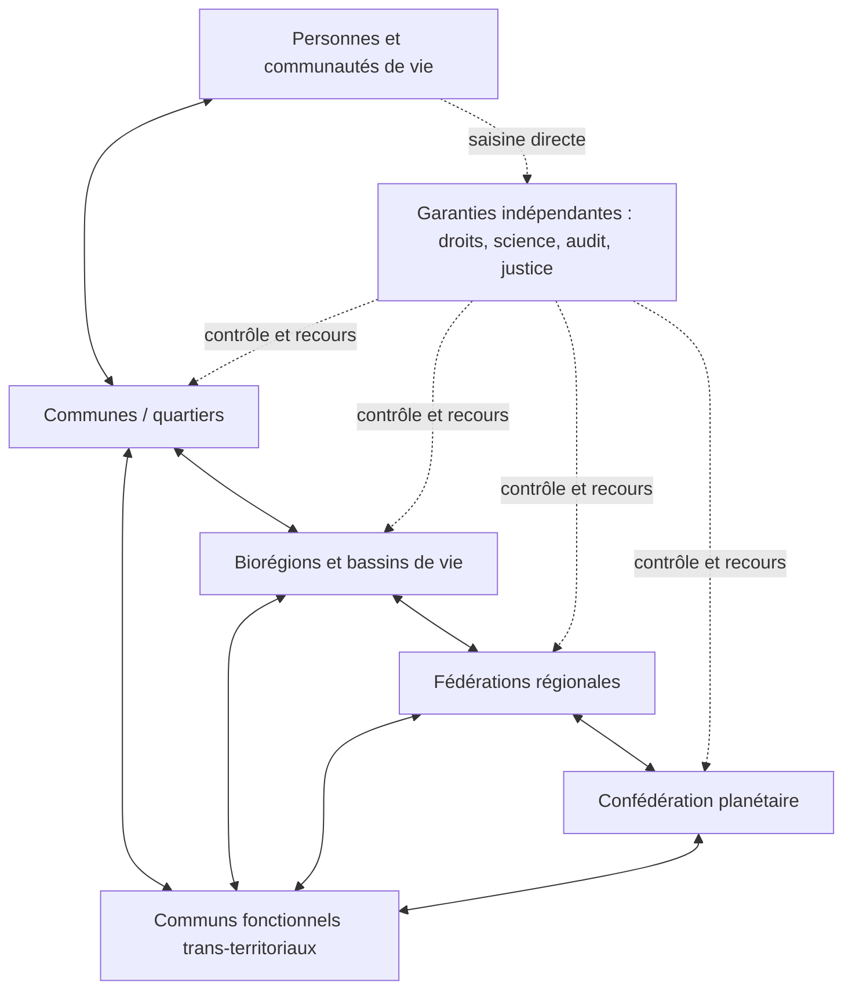

# Modèle d’organisation globale écosocialiste libertaire

## Version 0.13 — candidate préparée après l’arène adverse v1

### Statut

Ce texte est une proposition institutionnelle à éprouver, pas une constitution achevée ni la description d’un ordre déjà réalisable. Il conserve comme orientation de départ un écosocialisme libertaire mondialisé : égalité matérielle, limites écologiques contraignantes, autogouvernement, pluralisme et coordination planétaire sans souveraineté mondiale illimitée.

La version 0.1 a été soumise à sept cycles adversariaux documentés séparément : paralysie multi-échelle, capture administrative, jeu de la planification, domination locale, agression extérieure, sabotage de la transition et surcharge institutionnelle. La version 0.8 intégrait leurs reconstructions. La version 0.9 corrigeait la transition après P-001. La version 0.10 rendait le corridor de planification proportionnel au risque après P-002. La version 0.11 ajoutait quinze invariants et six reconstructions après cinquante tests-limites conceptuels CCT-L50-001. La version 0.12 proposait un noyau frugal après deux premiers jumeaux P-005. La version 0.13 prépare quatre révisions après une arène interne où l’interprétation exécutable étroite a perdu sur urgence, domination locale et siège informationnel. Aucun de ces exercices ne vaut validation empirique.

Le nom de travail du système est **Confédération des communs terrestres** (CCT).

## 1. Conclusion architecturale

La forme la plus cohérente n’est ni l’État mondial, ni la juxtaposition de communes souveraines, ni la planification centrale intégrale. C’est une architecture polycentrique composée de trois pouvoirs de nature différente :

1. des **territoires démocratiques fédérés**, chargés de garantir citoyenneté, droits et décisions de proximité ;
2. des **communs fonctionnels**, qui administrent les ressources et infrastructures suivant leurs bassins réels d’usage ;
3. une **confédération planétaire à mandat borné**, compétente uniquement pour les risques, droits et redistributions réellement transfrontaliers.

La règle structurante est : **centraliser la garantie et la coordination seulement quand l’échelle du problème l’exige ; distribuer l’initiative, l’exécution, le contrôle et la capacité de révocation**.

Le modèle distingue désormais trois couches :

1. un **noyau constitutionnel simple**, identique partout et directement opposable ;
2. des **institutions ordinaires lisibles**, adaptées aux territoires et aux fonctions ;
3. des **modules de contrôle renforcé**, activés seulement lorsqu’une décision implique irréversibilité, secret, coercition, monopole, dommage exporté ou atteinte possible aux droits fondamentaux.

## 2. Principes constitutionnels non négociables

### 2.1 Égale dignité et sécurité matérielle

Toute personne dispose, indépendamment de son emploi, de sa nationalité ou de son statut administratif, d’un socle opposable : eau, alimentation, logement, énergie de base, soins, éducation, mobilité essentielle, accès numérique, protection juridique et participation politique.

### 2.2 Liberté substantielle

La liberté comprend les libertés civiles classiques, mais aussi les moyens matériels de les exercer. Elle inclut notamment la liberté de conscience, d’expression, d’association, de circulation, de ne pas adhérer à une organisation, de contester les autorités et de quitter une communauté sans perdre ses droits fondamentaux.

### 2.3 Limites écologiques contraignantes

Les budgets de matière, d’énergie, d’émissions, d’eau et d’usage des sols constituent des plafonds juridiques. Ils sont révisables lorsque les connaissances changent, mais ne peuvent être dépassés par une majorité ordinaire au détriment d’autres populations ou des générations futures.

### 2.4 Subsidiarité exigeante

Une compétence appartient au niveau le plus proche des personnes concernées qui possède effectivement les moyens de l’exercer sans exporter ses dommages. Toute montée d’échelle doit être motivée, limitée, réévaluée et susceptible de redescendre.

### 2.5 Socialisation pluraliste

La propriété sociale ne signifie pas propriété exclusive de l’État. Elle peut prendre la forme de communs, coopératives, régies publiques, fiducies foncières, mutuelles, associations ou droits d’usage. La forme dépend de la fonction, du risque et de l’échelle.

### 2.6 Non-domination

Aucun acteur ne doit pouvoir durablement contrôler seul l’accès aux ressources vitales, à l’information publique, au crédit, à l’infrastructure, à la force, aux seuils écologiques ou aux règles de participation.

### 2.7 Réversibilité et recours

Toute décision publique importante doit avoir un responsable identifiable, une durée, un mécanisme de contestation, une procédure de suspension et, lorsque matériellement possible, une voie de retour. L’irréversible exige un seuil de décision supérieur et une justification publique renforcée.

### 2.8 Portabilité des droits

Les droits fondamentaux, dossiers essentiels, protections sociales et voies de recours suivent la personne. Aucun changement de commune, statut, emploi ou appartenance ne peut les interrompre. Sortir d’une institution n’oblige pas à perdre le monde matériel nécessaire à l’exercice de ses droits.

### 2.9 Lisibilité institutionnelle

Toute personne dispose d’une porte d’entrée publique unique par problème. L’administration route ensuite la demande sans transférer sa propre complexité à l’usager. Pour chaque décision sont publiés ceux qui proposent, décident, exécutent, contrôlent, suspendent et réparent.

### 2.10 Continuité des besoins vitaux

Les transformations de propriété ou de gouvernance ne peuvent interrompre eau, alimentation, énergie vitale, soins, paiements essentiels et communications de sécurité. La continuité protège les personnes, non les rentes ni le droit des anciens gestionnaires à retrouver leur veto.

### 2.11 Contrôle proportionné au pouvoir

La charge de contrôle augmente avec la coercition, le secret, l’irréversibilité, la dépendance créée et la capacité d’exporter des dommages. Une opération quotidienne réversible n’est pas soumise à la même procédure qu’un armement, un monopole de réseau ou un budget planétaire.

### 2.12 Pluralisme expérimental borné

Plusieurs mécanismes peuvent coexister lorsqu’ils respectent les mêmes droits, planchers sociaux et plafonds écologiques. Une institution n’est généralisée qu’après comparaison avec une alternative crédible ; son succès local ne devient pas une vérité constitutionnelle.

## 3. Les unités politiques

### 3.1 Commune ou quartier

Échelle de participation directe : services quotidiens, espaces publics, logement local, culture, entraide, budget participatif, police de proximité désarmée lorsque possible, médiation et adaptation locale des normes.

Taille indicative : assez petite pour permettre assemblées et jurys citoyens réels ; les grandes villes sont fédérations de quartiers et non unités politiques monolithiques.

### 3.2 Biorégion ou bassin de vie

Délimitée par les interdépendances écologiques et sociales plutôt que par la seule histoire administrative : bassin versant, système alimentaire, aire de mobilité, continuité d’habitat et réseaux énergétiques.

Compétences : eau, sols, biodiversité, alimentation, transports régionaux, planification foncière, santé territoriale, adaptation climatique et péréquation entre communes.

### 3.3 Fédération régionale

Elle coordonne les infrastructures lourdes, universités, hôpitaux spécialisés, réseaux électriques, industrie, grands transports, solidarité inter-biorégionale et droits sociaux communs.

Les anciens États peuvent devenir des fédérations régionales lorsqu’ils restent une échelle de solidarité pertinente. Leur souveraineté n’est plus absolue.

### 3.4 Confédération planétaire

Ses compétences sont énumérées et fermées :

- plafonds planétaires et répartition initiale des budgets écologiques ;
- droits fondamentaux et statut universel de la personne ;
- prévention des guerres, désarmement et contrôle des armements stratégiques ;
- fiscalité des flux transnationaux et lutte contre les refuges réglementaires ;
- infrastructures et standards d’interopérabilité mondiaux ;
- pandémies et risques existentiels ;
- mobilité humaine, asile et protection des apatrides ;
- justice climatique, dette écologique et fonds de réparation ;
- arbitrage des conflits entre régions ou communs transfrontaliers.

Toute compétence non énumérée reste aux niveaux inférieurs. L’extension des compétences mondiales requiert une double ratification populaire et territoriale, puis une clause de réexamen.

### 3.5 Communs fonctionnels

Les ressources suivent rarement les frontières. Des institutions dédiées administrent donc un fleuve, une forêt, une pêcherie, un réseau énergétique, un protocole numérique, une chaîne logistique ou un ensemble de connaissances.

Chaque commun réunit au minimum :

- les personnes qui en dépendent ;
- les travailleurs qui le maintiennent ;
- les territoires affectés ;
- une représentation des dommages écologiques ;
- des membres tirés au sort ;
- des contrôleurs indépendants sans pouvoir de gestion quotidien.

## 4. Répartition des compétences

| Domaine | Local | Biorégional | Régional | Planétaire |
|---|---|---|---|---|
| Logement | réalisation, attribution, contrôle d’usage | péréquation foncière | normes et financement | droit minimal, fonds de rattrapage |
| Alimentation | distribution, jardins, cuisines | plan alimentaire et sols | réserves, recherche | sécurité mondiale, interdiction du dumping |
| Énergie | sobriété et micro-réseaux | mix territorial | réseau et industrie | plafond carbone, transferts technologiques |
| Santé | soins primaires | prévention et hôpitaux généraux | spécialités et production | veille, brevets essentiels, réponse pandémique |
| Transport | marche, vélo, desserte | réseau quotidien | ferroviaire et fret | aviation, maritime, standards |
| Numérique | accès, médiation | centres de données adaptés | infrastructure publique | protocoles ouverts, droits, cybersécurité commune |
| Fiscalité | assiette locale limitée | péréquation | revenu, patrimoine, production | carbone importé, finance, multinationales |
| Justice | médiation et justice simple | juridictions ordinaires | appels | droits fondamentaux et conflits transfrontaliers |

Une décision change de niveau si au moins un des critères suivants est établi : dommage exporté, ressource partagée, incapacité matérielle locale, droit universel menacé ou avantage manifeste de mutualisation. La simple préférence d’un niveau supérieur ne suffit pas.

### 4.1 Registre de montée en échelle

Le passage d’une expérience locale à une règle générale n’est jamais présumé. Chaque proposition de fédéralisation documente : règle locale, conditions matérielles, apports extérieurs, population concernée, données perdues par agrégation, seuil retenu, variantes territoriales et propriété collective revendiquée.

Une coordination observée entre quelques communes ne prouve donc pas qu’une administration mondiale reproduira leur autonomie. Avant généralisation, on compare au moins deux formes d’agrégation et un scénario où la même finalité est obtenue sans transfert permanent de compétence. Si les résultats divergent selon l’agrégation, la pluralité est conservée ou la règle est bornée à son contexte.

## 5. Institutions démocratiques

### 5.1 Trois sources de légitimité, activées proportionnellement

À chaque niveau au-dessus de la commune existent trois sources de légitimité :

1. **Chambre des habitants**, élue à la proportionnelle ;
2. **Chambre des territoires**, où les unités membres sont représentées avec une dégressivité évitant à la fois l’hégémonie démographique et l’égalité fictive ;
3. **Conseil citoyen tiré au sort**, temporaire, stratifié et doté de temps, formation contradictoire et assistance indépendante.

Elles ne forment pas trois chambres permanentes dotées d’un veto général :

- la décision ordinaire relève de la chambre compétente et d’un contrôle a posteriori ;
- une décision distributive majeure ou transférant une compétence exige une double clé habitants-territoires ;
- le Conseil citoyen intervient pour les révisions constitutionnelles, irréversibilités importantes, urgence durable et conflits d’intérêts systémiques ;
- une loi ordinaire peut être renvoyée une fois par une autre source de légitimité, mais non bloquée indéfiniment ;
- après échec d’une conciliation à durée fixe, une règle de résolution publiée à l’avance s’applique et peut être contestée devant la justice.

### 5.2 Mandats

- mandat court, renouvelable une seule fois consécutivement pour les exécutifs ;
- incompatibilité entre mandat exécutif, direction d’une grande organisation économique et contrôle d’un média dominant ;
- publication des intérêts, rencontres et contributions à la décision ;
- révocation populaire à seuil raisonnable, avec procédure contradictoire ;
- délai avant reconversion dans les secteurs régulés ;
- rotation obligatoire des fonctions de présidence et de fixation de l’ordre du jour.

### 5.3 Exécutif collégial

L’exécutif est un conseil pluraliste, non une présidence souveraine. Ses portefeuilles sont séparés ; aucun membre ne contrôle simultanément budget, nomination, sécurité et information. Les actes réglementaires expirent sans confirmation législative.

### 5.4 Initiative populaire

Les citoyens disposent de quatre instruments distincts : pétition avec réponse motivée, initiative législative, référendum suspensif et assemblée constituante ponctuelle. Les seuils sont proportionnés à l’effet demandé et accessibles aux personnes sans capital organisationnel.

### 5.5 Opposition garantie

L’opposition reçoit des moyens publics, la présidence de certaines commissions d’enquête, un accès aux données et un droit de saisine rapide de la justice. La dissidence non violente ne peut être assimilée à une atteinte à l’ordre constitutionnel.

### 5.6 Égalité temporelle

Le temps politique est une ressource distribuée. Une consultation identique en jours peut exclure les personnes qui assurent le soin, travaillent de nuit, dépendent d’une traduction ou vivent une urgence matérielle.

- indemnité, garde d’enfants, accessibilité et temps de préparation pour participer ;
- délais plus longs lorsque traduction, dispersion géographique ou contre-expertise l’exigent ;
- procédure accélérée seulement si le retard produit une perte supérieure et identifiable ;
- droit de demander une pause qui conserve effectivement les options ;
- files d’attente publiques et contestables pour prestations et recours ;
- interdiction des expirations silencieuses de droits ;
- mesure séparée du délai subi et de la perte qu’il provoque selon les groupes.

Celui qui fixe l’ordre du jour, la date limite ou la cadence exerce un pouvoir et doit être contrôlé comme tel.

## 6. Comment une décision est prise

1. **Saisine** : problème défini, personnes touchées identifiées, niveau proposé justifié.
2. **Instruction ouverte** : données, alternatives, impacts distributifs et limites écologiques publiés.
3. **Contre-expertise financée** : minorités, travailleurs et territoires affectés disposent de ressources autonomes.
4. **Délibération** : auditions contradictoires et temps minimal incompressible hors urgence réelle.
5. **Décision** : majorité adaptée au degré d’irréversibilité.
6. **Exécution distribuée** : objectifs communs, variantes locales publiées.
7. **Observation** : effets, coûts, contournements et dommages déplacés mesurés.
8. **Révision** : maintien, modification, suspension ou extinction à date fixée.

Toute décision doit publier une fiche minimale : compétence juridique, responsable, bénéficiaires, porteurs de coûts, budget, durée, indicateurs, voies de recours, mécanisme d’arrêt et condition de réussite.

Avant l’instruction, la décision est classée comme ordinaire, distributive majeure, irréversible, coercitive, secrète ou urgente. La classification est motivée, immédiatement contestable et contrôlée par un organe différent de celui qui souhaite décider.

En cas de conflit de compétence :

1. médiation à durée fixe ;
2. mesure conservatoire prise par le niveau capable d’empêcher le dommage imminent ;
3. examen juridictionnel rapide ;
4. réparation si le niveau provisoire a excédé sa compétence.

Le silence d’une institution à l’échéance déclenche une règle publique préétablie. Il ne confère jamais un pouvoir discrétionnaire au secrétariat. Un recours suspend la partie irréversible ou gravement attentatoire, pas automatiquement l’ensemble d’un service vital.

## 7. Constitution économique

### 7.1 Quatre sphères

**Sphère garantie** : besoins fondamentaux fournis hors marché ou à prix social. Leur accès n’est pas conditionné à l’emploi.

**Sphère des communs et services publics** : ressources naturelles, infrastructures essentielles, crédit de base, données publiques, santé, éducation et grands réseaux.

**Sphère coopérative et associative** : forme normale de l’entreprise moyenne et grande. Les travailleurs disposent de la majorité des droits de gouvernance, les usagers et territoires ayant une voix lorsque les externalités sont fortes.

**Sphère marchande bornée** : activités non essentielles ouvertes à l’entreprise individuelle ou privée, sous règles sociales, écologiques, antimonopolistiques et fiscales. L’accumulation n’y confère aucun droit politique supplémentaire.

### 7.2 Propriété et taille

- propriété personnelle pleinement protégée ;
- usage du logement protégé, rente foncière et vacance spéculative limitées ;
- héritage personnel possible dans une franchise, concentration dynastique empêchée ;
- seuils de socialisation graduelle lorsque taille, dépendance publique, monopole ou risque systémique augmentent ;
- ressources naturelles inaliénables, avec droits d’usage révocables ;
- rachat public ou transfert coopératif indemnisé selon la légitimité de l’acquisition, l’amortissement et les dommages passés.

### 7.3 Planification démocratique

La planification porte d’abord sur les contraintes et capacités structurantes, non sur chaque bien : budget carbone, matières critiques, énergie, sols, eau, logements, soins, alimentation, transport et infrastructures. Elle fonctionne par **corridors** : un plancher social opposable, un plafond écologique contraignant et, entre les deux, plusieurs mécanismes de coordination comparables.

Le cycle de planification, révisé par bilans glissants, articule :

1. inventaire physique transparent, complété par échantillons indépendants ;
2. scénarios scientifiques pluriels ;
3. choix démocratique des priorités ;
4. réserves, redondances et marges de sécurité explicitement financées ;
5. contrats de production et d’investissement ;
6. combinaison sectorielle de contrats négociés, allocations publiques, prix bornés, enchères ouvertes de capacité et initiatives coopératives ;
7. bilans glissants et marges d’expérimentation locale ;
8. révision après observation des pénuries, attentes, substitutions forcées, rentes et travail compensatoire.

Les prix subsistent comme signaux locaux mais ne décident ni des droits fondamentaux ni des plafonds écologiques. Ils sont complétés par des comptes physiques et des critères d’accès. Une unité peut expérimenter une autre méthode d’allocation si elle conserve le plancher, le plafond, la traçabilité et le recours.

Les acteurs évalués ne contrôlent jamais seuls les capteurs ni la qualification de leurs propres données. Des audits aléatoires et des observations hors indicateurs-cibles recherchent reclassement opportuniste, stocks cachés, impacts délocalisés et conformité purement documentaire.

Le corridor fonctionne à **deux régimes**. En régime ordinaire, le plancher, le plafond, les comptes physiques et le recours restent permanents, mais l’allocation utilise des règles simples et stables. Les réserves, contre-expertises et capacités d’audit sont entretenues en arrière-plan. Le régime renforcé s’active sur des signaux publics préspécifiés : volatilité matérielle, pénurie, concentration d’un fournisseur, divergence entre flux physiques et déclarations, reclassements répétés ou externalisation probable. Son extinction est automatique après retour durable sous les seuils. Cette proportionnalité évite de payer en permanence la charge administrative maximale sans transformer l’activation en choix discrétionnaire d’un centre.

### 7.4 Travail

- garantie d’emploi socialement utile ou revenu social inconditionnel suffisant ;
- réduction progressive du temps de travail ;
- égalité de droits entre travail rémunéré, soin, formation et participation civique ;
- codécision des travailleurs sur l’organisation, la technologie et les fermetures ;
- fonds de conversion assurant revenu, formation et mobilité lors de l’arrêt d’une activité nuisible ;
- droit de refus face à un danger grave, avec expertise indépendante.

### 7.5 Finance et monnaie

Le crédit essentiel devient une infrastructure publique pluraliste : banques locales coopératives, banques régionales d’investissement et chambre mondiale de compensation.

- création monétaire orientée vers les capacités écologiques et sociales votées ;
- séparation des paiements, de l’épargne sûre et de l’investissement risqué ;
- interdiction ou forte limitation des instruments purement extractifs ;
- registre public des bénéficiaires effectifs ;
- contrôle temporaire des capitaux en cas de fuite spéculative ;
- mécanisme ordonné de restructuration des dettes publiques insoutenables ;
- unité de compte internationale pour équilibrer les échanges sans imposer une monnaie mondiale unique.

## 8. Métabolisme écologique

### 8.1 Budgets planétaires

Une Autorité des limites terrestres établit des fourchettes scientifiques publiques. La décision politique choisit, dans ces fourchettes, les marges de sécurité et la répartition. Les scientifiques n’exercent donc ni souveraineté directe ni simple fonction décorative.

La répartition combine :

- égalité d’usage par personne ;
- besoins fondamentaux et vulnérabilité ;
- responsabilité et consommation historiques ;
- capacité technique et financière d’agir ;
- droit au développement matériel des régions sous-équipées ;
- protection des peuples et territoires gardiens d’écosystèmes.

### 8.2 Comptabilité matière-énergie

Chaque territoire publie les flux extraits, importés, transformés, consommés, réparés, recyclés et rejetés. Les impacts incorporés aux importations comptent dans son bilan pour éviter l’écologie par délocalisation.

### 8.3 Allocation sous rareté

L’ordre de priorité est constitutionnel : besoins vitaux, maintien des écosystèmes, infrastructures de transition, usages collectifs, puis usages discrétionnaires. Les quotas personnels ne sont employés que si des normes de production et une allocation collective ne suffisent pas ; ils sont transférables seulement sous conditions empêchant leur concentration.

### 8.4 Représentation du vivant

Les écosystèmes n’ayant pas de voix directe reçoivent des gardiens juridiquement responsables, nommés par plusieurs voies et révocables. Leur action est fondée sur des obligations écologiques justiciables, non sur la prétention à « parler au nom de la nature » sans contrôle.

## 9. Justice globale et réparation

### 9.1 Fonds mondial de convergence

Il finance l’accès universel aux infrastructures essentielles et la transition des régions exposées. Ses recettes proviennent notamment des patrimoines extrêmes, transactions financières, rentes extractives, transports internationaux, profits déplacés et émissions historiques encore attribuables.

### 9.2 Dette écologique

Elle n’est ni une culpabilité héréditaire indifférenciée ni une dette infinie. Elle est allouée selon quatre attaches : bénéfices reçus, capacité actuelle de réparer, contribution aux mécanismes dommageables et pertes effectivement portées.

La réparation peut être financière, technologique, territoriale, sanitaire, documentaire, institutionnelle ou relationnelle. Elle comporte une condition de clôture, un recours et la reconnaissance de ce qui ne peut être restauré.

### 9.3 Mobilité et appartenance

Toute personne possède des droits fondamentaux partout. La résidence factuelle crée progressivement les droits politiques locaux selon une règle commune que les autorités locales ne peuvent durcir. La citoyenneté multiple est admise. L’asile écologique existe. Aucune communauté ne peut défendre son autonomie par l’exclusion ethnique, religieuse ou patrimoniale.

Une personne menacée par son autorité locale doit pouvoir saisir confidentiellement un défenseur situé hors du territoire. Le mécanisme proposé associe cette saisine à une assistance juridique, un revenu, un logement de protection et, si la personne le demande, une relocalisation temporaire. Il reste à établir les capacités matérielles, les délais, le financement et les voies dégradées qui rendraient cette protection effectivement disponible. Elle conserve aussi le droit de rester : les juridictions supérieures pourraient protéger une personne, suspendre un responsable ou administrer provisoirement un service précis sans placer toute la communauté sous tutelle. Si la sortie fut contrainte, droit au retour et restauration des accès sont examinés séparément d’une simple indemnisation.

Les communautés linguistiques, culturelles et religieuses peuvent exercer une autonomie non territoriale sur leurs institutions volontaires, toujours sous réserve des droits individuels et du droit de ne pas y participer.

## 10. Information, langues, connaissance et numérique

### 10.1 Infrastructure de connaissance

- résultats de recherche financés publiquement placés en commun ;
- logiciels et standards des infrastructures publiques ouverts et auditables ;
- protection forte des données personnelles et interdiction de la notation civique générale ;
- portabilité des identités et services pour éviter la captivité numérique ;
- médias publics gouvernés par des collèges indépendants de l’exécutif ;
- fonds pluraliste pour médias coopératifs, attribué selon des règles transparentes ;
- plafonds de concentration séparés pour propriété, audience, infrastructure de diffusion et publicité ;
- transparence des systèmes de recommandation dominants et choix réel d’autres classements ;
- droit d’accès équitable aux informations de l’administration, de la défense et des experts ;
- mesure publique de la sélection, de la répétition et de la circulation des sources, pas seulement de la diversité des opinions publiées ;
- archives publiques accessibles, avec protection des données sensibles et droit de rectification.

Un système automatisé peut recommander ou administrer une procédure bornée ; il ne reçoit jamais seul le pouvoir de définir un droit, une sanction, une priorité vitale ou l’état d’urgence.

Une pluralité de titres ne vaut pas pluralité si tous reprennent la même agence, la même base de données ou le même cadrage. Les informations décisives sont accompagnées d’un passeport public indiquant auteur, institution, mandat, financement, données primaires, chaîne de reprises, langue initiale, traductions, public visé et voie de contestation.

### 10.2 Constitution linguistique

Aucune langue pivot ne possède un statut épistémique supérieur. Toute personne peut employer une langue reconnue de son territoire et recevoir traduction dans les procédures qui affectent ses droits.

- budgets de traduction et d’interprétation considérés comme infrastructure démocratique ;
- conservation du texte original à côté des versions traduites ;
- glossaires juridiques publics indiquant les divergences sans forcer de faux équivalents ;
- droit de contester une traduction ayant modifié un statut, une preuve ou une obligation ;
- rotation des langues de travail des institutions mondiales ;
- représentation des langues minoritaires dans les organes de normalisation ;
- délais adaptés lorsque plusieurs chaînes de traduction sont nécessaires ;
- actes constitutionnels ratifiés dans plusieurs versions faisant également foi, avec chambre d’arbitrage linguistique pluraliste.

Lorsque aucun équivalent exact n’existe, le terme local et son champ de conflit sont conservés. La traduction n’est pas un service auxiliaire : elle distribue l’accès, la légitimité et la capacité d’agir.

## 11. Justice, sûreté et force

### 11.1 Justice

La justice est indépendante, accessible et principalement réparatrice lorsque la sécurité le permet. Les victimes conservent une voix et un recours ; la réparation ne leur est pas imposée comme devoir de réconciliation.

### 11.2 Sûreté

Les fonctions sont séparées entre prévention, médiation, enquête, intervention armée et détention. L’échelon local ne commande pas seul les enquêtes visant ses dirigeants. Tout usage de la force laisse une trace contrôlable et déclenche un examen extérieur proportionné.

### 11.3 Défense

La défense commune possède trois couches : protection civile et résilience locale ; forces régionales professionnelles bornées ; capacités stratégiques confédérales strictement énumérées. Sa doctrine est défensive et le droit humanitaire demeure opposable en situation d’attaque.

Un commandement unifié peut être activé par des déclencheurs précis et pour une durée courte. Les clés de renseignement, ciblage, engagement, détention et prolongation appartiennent à des acteurs différents. Un comité pluraliste habilité au secret contrôle la légalité et publie des preuves non opérationnelles de l’autorisation ; un inspecteur indépendant peut suspendre une catégorie d’opérations.

Les unités territoriales ne peuvent constituer une armée privée ; la confédération ne peut déployer durablement une force intérieure sans renouvellement législatif et contrôle juridictionnel. L’objection de conscience ouvre un service civil équivalent.

L’objectif de long terme est le désarmement vérifiable et réciproque, avec conversion des industries et protection économique des travailleurs concernés. Après activation, démobilisation, restitution des pouvoirs civils, archives contrôlées et réparations sont testées séparément ; la fin déclarée de la crise ne suffit pas.

La sécurité comprend la redondance des médicaments, de l’énergie, des communications, des semences, des paiements et des routes logistiques. Une dépense militaire est refusée lorsque son coût marginal diminue davantage la sécurité humaine qu’il ne réduit une menace documentée.

### 11.4 Carte complète de la coercition

La coercition ne se limite pas aux armes. L’audit constitutionnel suit également le contrôle des frontières, registres, identités, mers, airs, paiements, énergie, information, logistique, détention, sanctions, expropriations et infrastructures vitales.

Chaque réduction de capacité coercitive précise : capacité nuisible de chaque acteur, asymétrie initiale, ordre d’exécution, vérification indépendante, garantie contre réactivation et recours des populations. Un désarmement qui retire seulement les moyens du plus faible tout en laissant intact le dispositif dominant n’est pas qualifié de paix.

Les sanctions économiques doivent viser en priorité les responsables, rentes, capacités logistiques et biens discrétionnaires. Elles sont suspendues lorsqu’elles privent une population de soins, d’eau, d’alimentation, d’énergie vitale ou de moyens de recours sans réduire la capacité de décision ciblée.

## 12. Urgence sans dictature provisoire permanente

Une urgence valide exige : danger défini, preuve publique dans la mesure du possible, territoire et durée bornés, compétences précisément listées et impossibilité motivée de suivre la procédure ordinaire.

- durée initiale très courte ;
- renouvellement conjoint par représentants des habitants et des territoires, avec jury citoyen obligatoire au-delà de la durée initiale ;
- contrôle judiciaire permanent ;
- opposition et presse jamais suspendues comme telles ;
- interdiction de modifier la constitution pendant l’urgence ;
- journal public des décisions et marchés ;
- expiration automatique ;
- commission indépendante après crise ;
- indemnisation des pertes illégitimement imposées.

Le pouvoir d’arrêter une mesure dangereuse est distinct du pouvoir de la relancer. La restauration de l’ordre ordinaire est testée en pratique ; elle n’est pas présumée parce que l’urgence a été déclarée terminée.

## 13. Où se cacheraient les centres de pouvoir

La structure formelle ne suffit pas. Un centre réel apparaît chez celui qui contrôle une clé, un seuil, un quorum, un classement, une exception, un calendrier, une archive, un réseau ou la preuve admise.

Les zones à surveiller prioritairement sont :

| Centre possible | Capacité de domination | Contrepoids obligatoire |
|---|---|---|
| Autorité scientifique | définir les scénarios admissibles | pluralité, données ouvertes, contre-expertise |
| Administration de la planification | contrôler catégories et allocations | mandats publics, appel, rotation, audit |
| Chambre de compensation | couper crédit et paiements | gouvernance plurielle, continuité minimale garantie |
| Infrastructure numérique | filtrer accès et visibilité | protocoles ouverts, interopérabilité, contrôle usager |
| Exécutif d’urgence | concentrer vitesse et secret | extinction, juge, contrôle ex post, séparation relance |
| Grands communs | devenir monopoles corporatistes | représentation des usagers et territoires, droit d’appel |
| Fédérations riches | bloquer la redistribution | vote populaire mondial et plancher de contribution |
| Appareils de sécurité | monopoliser information et force | organes séparés, traçabilité, contrôle civil croisé |

Aucun organe ne doit cumuler la fixation de l’indicateur, la collecte des données, l’évaluation du résultat et la sanction.

### 13.1 Administration opératrice et administration contradictrice

La rotation des élus ne neutralise pas le pouvoir des permanents qui contrôlent catégories, agenda, traduction, archives et options recevables. Les fonctions critiques sont donc séparées :

- le **service opérateur** maintient le savoir, les réseaux et la continuité ;
- le **service public contradicteur**, financé de manière autonome et pluriannuelle, reproduit les calculs, enquête sur les options écartées et assiste minorités, oppositions et jurys ;
- un registre conserve les options refusées, leur auteur, leur motif et leur date ;
- les fonctions d’agenda, classement, nomination et audit tournent, sans imposer une rotation destructrice de tous les métiers ;
- les jurys peuvent engager leurs propres enquêteurs ;
- une décision peut être contestée par sa catégorie et ses données, pas seulement dans le cadre fixé par l’administration.

L’appareil contradicteur est lui-même évalué : s’il ne détecte plus d’erreurs ni ne modifie de décisions tout en ajoutant une charge importante, son périmètre est réduit ou recomposé.

## 14. Prévention de la reconstitution des classes dominantes

Le système suit dix vecteurs de reconcentration : propriété, rente, monopole, veto, héritage, immunité, contrôle territorial, contrôle productif, déplacement des coûts et capacité de réactivation.

Les protections comprennent :

- publicité des bénéficiaires réels et des chaînes de financement ;
- plafonnement des concentrations économiques et médiatiques ;
- fiscalité fortement progressive du patrimoine et des successions élevées ;
- droit de reprise coopérative ;
- incompatibilités et rotation des fonctions ;
- financement autonome des contre-pouvoirs ;
- capacité citoyenne de bloquer, enquêter, archiver, sanctionner et réparer ;
- révision régulière des concessions et délégations ;
- interdiction des immunités contractuelles face aux droits fondamentaux ;
- examen des coûts déplacés hors territoire et hors bilan.

Une réforme n’est tenue pour réelle que si elle retire effectivement une capacité de domination ou crée chez les personnes concernées une capacité autonome de détection, contestation, blocage, sanction, réparation ou financement.

## 15. Métriques et adaptation stratégique

Les indicateurs publics servent au diagnostic ; aucun score composite unique ne gouverne l’ensemble. Pour chaque objectif, on conserve plusieurs mesures, des données qualitatives, une observation hors cible et un droit de contestation.

Exemples de couples à ne pas confondre :

- baisse territoriale des émissions / baisse de l’empreinte importée ;
- nombre de logements / capacité réelle à habiter dignement ;
- taux d’emploi / sécurité, utilité et autonomie au travail ;
- temps de consultation / influence réelle sur la décision ;
- part de propriété publique / pouvoir effectif des usagers et travailleurs ;
- revenu moyen / accès universel et concentration patrimoniale.

Lorsqu’un indicateur devient une cible, sa relation avec l’objectif doit être réobservée. Les audits cherchent l’évitement, la falsification, le déplacement géographique, le transfert de charge vers le travail invisible et la conformité purement documentaire.

## 16. Cycle de maintenance constitutionnelle

Les rôles sont séparés :

| Fonction | Acteur principal | Contrôle |
|---|---|---|
| Proposer une réforme | citoyens, territoires, institutions | recevabilité juridique minimale |
| Instruire | convention pluraliste | données et auditions ouvertes |
| Refuser provisoirement | chambre ou juge selon motif | décision motivée et appel |
| Autoriser | collèges démocratiques | majorité renforcée selon effet |
| Expérimenter | territoires volontaires | droits fondamentaux intangibles |
| Évaluer | équipes indépendantes multiples | méthodes et données publiées |
| Généraliser | chambres + citoyens | résultats non automatiquement décisifs |
| Suspendre | juge, assemblée ou initiative d’urgence | contrôle croisé rapide |
| Restaurer | exécutifs compétents | test effectif et audit des pertes |
| Réparer | fonds et responsables désignés | recours des porteurs de pertes |

Une réforme traverse des états distincts : proposée, écrite, expérimentée, évaluée, autorisée, déployée et réobservée. Un succès local ne prouve pas sa robustesse mondiale ; les pilotes doivent varier taille, richesse, culture politique, stress, canal de participation et capacité administrative.

### 16.1 Budget de complexité

Toute institution nouvelle doit indiquer l’organe qu’elle remplace, fusionne ou laisse subsister avec justification. Sont comptés comme coûts politiques : temps administratif des ménages, nombre d’autorisations, délais, charge de preuve, coût de traduction, besoin d’assistance spécialisée et nombre de points de veto.

- un défenseur public unique reçoit toute demande et la route vers l’autorité compétente ;
- les contrôles lourds s’activent selon le risque, non selon le prestige du dossier ;
- les organes exceptionnels expirent automatiquement ;
- une convention périodique de simplification peut supprimer les doublons mais pas un recours sans démontrer une protection équivalente ;
- toute simplification est annulée si elle réduit davantage la détection, la contestation ou la réparation d’un dommage grave qu’elle ne réduit la charge civique ;
- une carte publique et intelligible indique, pour chaque fonction, qui propose, décide, exécute, contrôle, suspend et répare.

## 17. Stratégie de transition

Les phases indiquent une direction politique, mais leur franchissement dépend de **portes de capacité**. Avant tout transfert critique sont cartographiés : intrants, opérateurs, données, licences, stocks, financement, maintenance, dépendances étrangères et voies de substitution. Une capacité alternative est construite, testée en charge, autorisée puis réobservée avant de démanteler l’ancienne.

La préparation ne confère pas un veto indéfini : chaque porte possède un responsable, une date de décision, des critères publics, une contre-évaluation et une solution si l’acteur en place refuse de coopérer.

Pour un service vital, la porte est couplée à une **cellule de continuité bornée**. Elle peut coordonner stocks, substitutions, personnels et fournisseurs pendant une fenêtre préautorisée, mais ne peut modifier les droits, les fins du service ou la propriété. Son activation exige deux clés détenues par des collèges distincts ; chaque acte est journalisé ; usagers et travailleurs disposent d’un canal d’alerte direct ; son mandat expire automatiquement. Une équipe indépendante possède dès l’ouverture les accès nécessaires pour restaurer le régime ordinaire et supprimer clés, données temporaires et délégations.

Si l’acteur sortant bloque la porte, la cellule utilise une cartographie et des accords de secours conservés hors de sa dépendance. L’échec de cette voie indépendante suspend le transfert : il ne justifie ni un passage aveugle ni la prolongation automatique du pouvoir exceptionnel.

### Phase 0 — Préfiguration immédiate

- fédérer coopératives, syndicats, mutuelles, municipalités, mouvements écologistes et communautés autochtones sans exiger leur fusion doctrinale ;
- créer des assemblées locales, budgets participatifs et institutions de communs ;
- développer données ouvertes, outils publics et contre-expertise ;
- cartographier les nœuds vitaux : paiements, énergie, médicaments, logistique, information, pièces et foncier ;
- constituer stocks, compétences, logiciels compatibles et accords de secours ;
- établir un programme commun minimal de droits, démocratisation économique et plafonds écologiques.

### Phase 1 — Double pouvoir démocratique

- services essentiels universels ;
- garantie de revenu et réduction du temps de travail ;
- codécision dans les grandes entreprises ;
- banques publiques et coopératives ;
- registre des mouvements de capitaux, mécanisme de moratoire et chambre de restructuration des dettes ;
- socialisation progressive de l’énergie, du foncier stratégique et des infrastructures ;
- droit de reprise anticipée des entreprises abandonnées et licences obligatoires pour productions vitales ;
- conventions citoyennes permanentes et référendum suspensif ;
- alliances fiscales et climatiques entre territoires volontaires.

### Phase 2 — Fédéralisation régionale

- transformation des États en fédérations subsidiaires ;
- constitution des biorégions et chambres territoriales ;
- transfert des grands réseaux à des communs multi-acteurs ;
- harmonisation ascendante des droits sociaux et écologiques ;
- mécanismes de péréquation automatiques.

### Phase 3 — Confédération planétaire

- assemblée constituante mondiale issue à la fois du suffrage, des territoires et du tirage au sort ;
- chambre de compensation et fiscalité transnationale ;
- budget écologique mondial et fonds de convergence ;
- statut universel de la personne ;
- désarmement séquencé, vérifiable et symétrique ;
- juridiction planétaire aux compétences énumérées.

### Phase 4 — Réobservation et correction

Après chaque transfert de compétence, vérifier : capacités réellement retirées aux oligopoles, capacités acquises par les populations, coûts cachés, groupes exclus, nouveaux centres, possibilité de sortie, dommages irréversibles et canaux de restauration.

En cas d’échec, le retour vise d’abord la continuité du service et des droits. Il ne restitue jamais automatiquement propriété, données, rente ou veto aux anciens détenteurs : une autre forme publique, coopérative, commune ou marchande bornée est choisie après examen.

Des mesures temporaires de protection — contrôle des capitaux, continuité obligatoire d’un service vital, réquisition indemnisée, moratoire de dette — exigent durée, contrôle juridictionnel, porteurs de pertes identifiés et voie de réparation. Leur caractère transitoire est testé dans les faits.

## 18. Tests de résistance

Les scénarios détaillés des sept cycles adversariaux complètent les tests synthétiques ci-dessous. Ils deviennent un corpus de régression : une réforme qui réintroduit une paralysie généralisée, un monopole administratif, une planification mensongère, une sortie forcée, un commandement sans démobilisation, une transition sans capacité ou une complexité sans porte d’entrée doit être justifiée comme une modification explicite, non présentée comme neutre.

### 18.1 Une région riche refuse la solidarité

Elle conserve son autonomie culturelle et administrative mais ne peut se soustraire aux contributions liées aux externalités, avantages systémiques et garanties communes. Le conflit passe par médiation, justice, puis sanctions proportionnées sur les flux non vitaux. Les droits de sa population ne sont pas pris en otage.

### 18.2 Une majorité locale opprime une minorité

Les droits fondamentaux prévalent. La minorité peut saisir directement les juridictions supérieures et recevoir protection et financement. La subsidiarité ne protège pas la domination locale.

### 18.3 La planification produit pénurie et marché noir

Les besoins vitaux sont sécurisés en priorité ; les données et règles d’allocation sont publiées ; une commission pluraliste recherche erreur de prévision, prix irréaliste, rente de rareté ou sabotage. Les mécanismes locaux sont assouplis si cela respecte le plafond écologique et l’égalité d’accès.

### 18.4 Une bureaucratie verte monopolise l’expertise

Les modèles sont ouverts, les scénarios concurrents financés et les mandats rotatifs. L’autorité scientifique expose les contraintes et incertitudes ; elle ne choisit pas seule les fins sociales. Un jury citoyen peut imposer une contre-enquête.

### 18.5 Une urgence climatique exige une décision rapide

Un exécutif peut prendre des mesures conservatoires courtes et réversibles. Toute transformation durable, confiscation ou restriction majeure requiert validation rapide par les autres collèges et recours juridictionnel.

### 18.6 Une plateforme coopérative devient indispensable

Son statut coopératif ne suffit pas. Interopérabilité, portabilité, séparation des fonctions, droit d’accès minimal et possibilité de reprise publique s’appliquent dès qu’elle acquiert un pouvoir d’infrastructure.

### 18.7 Une contre-révolution électorale arrive au pouvoir

Elle peut modifier les politiques ordinaires mais non abolir seule droits, pluralisme, élections, autonomie territoriale et limites de mandat. Les institutions de sécurité ne sont contrôlées par aucun exécutif unique. Les forces sociales conservent organisation, information, financement et recours.

### 18.8 La transition écologique frappe surtout les pauvres

Toute mesure est accompagnée d’un bilan par niveau de revenu, genre, territoire, statut migratoire et type de travail. Les alternatives accessibles précèdent les interdictions lorsque le délai écologique le permet. La redistribution compense en capacité d’usage, pas seulement en argent.

## 19. Tableau de bord minimal

Le système est évalué par tendances et distributions, jamais par une note souveraine.

### Pouvoir

- concentration de propriété, crédit, médias et infrastructures ;
- part de la population pouvant effectivement saisir, contester et faire suspendre une décision ;
- rotation des charges et origine sociale des mandataires ;
- délai et coût d’un recours ;
- décisions annulées ou corrigées après contestation.

### Égalité matérielle

- accès effectif aux services fondamentaux ;
- écarts de patrimoine, temps libre, santé et exposition au risque ;
- travail non rémunéré et charge de soin ;
- sécurité économique pendant les transitions.

### Écologie

- flux physiques territoriaux et empreinte importée ;
- état des écosystèmes et résilience ;
- part des ressources réparées, réemployées et recyclées ;
- distribution sociale des usages et nuisances.

### Démocratie

- participation diversifiée, influence démontrable et taux de mise en œuvre ;
- pluralité des sources d’information ;
- accès à la contre-expertise ;
- usage, délai et résultat des mécanismes de révocation et d’initiative.
- temps administratif, charge de preuve et nombre d’interlocuteurs imposés aux personnes ;
- décisions dont le responsable, l’exécutant ou la voie d’arrêt reste inconnu du public.

### Résilience et continuité

- durée des stocks et existence de fournisseurs ou procédés substituables ;
- temps de restauration des paiements, soins, énergie et communications ;
- pénuries, files, substitutions forcées et travail invisible compensatoire ;
- pouvoirs d’urgence effectivement rendus et capacités coercitives démobilisées ;
- dépendance d’un service vital à un fournisseur, métier, territoire ou système unique.

### Réparation

- capacité d’usage retrouvée ;
- récidive du dommage ;
- transfert effectif vers les porteurs de pertes ;
- pertes irréparables reconnues ;
- satisfaction procédurale distincte de la clôture administrative.

## 20. Décisions politiques encore ouvertes

Le modèle ne doit pas résoudre sans débat les arbitrages suivants :

1. **Revenu social ou garantie d’emploi** : le premier protège mieux le refus, la seconde organise plus directement les besoins collectifs. Une combinaison est proposée, mais son équilibre reste politique.
2. **Place exacte des marchés** : la frontière entre expérimentation décentralisée et marchandisation doit varier selon secteur, dépendance et externalité.
3. **Degré de dégressivité territoriale** : il faut empêcher simultanément la domination des régions peuplées et le veto permanent des petites unités.
4. **Droit de sécession** : possible en principe, mais incompatible avec l’abandon unilatéral de dettes, minorités, infrastructures communes et obligations écologiques.
5. **Sanctions collectives** : elles risquent de déplacer le coût vers les populations ; les sanctions ciblant capacités de décision, rentes et flux de luxe doivent être privilégiées.
6. **Usage légitime de la coercition** : aucune société ne l’abolit par proclamation ; elle doit être réduite, distribuée, traçable, contestable et privée de reproduction autonome.
7. **Rythme de socialisation** : trop lent, il laisse aux acteurs dominants le temps d’organiser la fuite ; trop rapide sans capacités alternatives, il peut désorganiser les besoins vitaux.
8. **Seuil d’activation des contrôles renforcés** : trop bas, il reconstitue la paralysie ; trop haut, il laisse passer des décisions réellement irréversibles ou coercitives.
9. **Architecture de défense** : la répartition exacte entre protection civile, forces régionales et capacités confédérales dépend des menaces, technologies et interdépendances observables.
10. **Degré de redondance** : la résilience exige des capacités inutilisées en temps normal, mais leur coût matériel doit rester compatible avec les plafonds écologiques.

## 21. Conditions d’échec du modèle

Il faudrait réviser profondément cette architecture si l’expérience montrait de manière robuste que :

- la pluralité des collèges produit systématiquement une paralysie face aux crises plutôt qu’un contrôle utile ;
- les communs fonctionnels se ferment durablement en corporations impossibles à démocratiser ;
- la subsidiarité permet une exportation massive des dommages malgré les recours ;
- la planification physique échoue dans des contextes variés à garantir les besoins mieux que des mécanismes alternatifs ;
- la confédération mondiale accumule des compétences et une force impossibles à révoquer ;
- la socialisation change les titres de propriété sans réduire rente, veto, héritage, monopole ni déplacement des coûts ;
- les mécanismes de participation restent captés par les personnes disposant déjà de temps, d’instruction et de sécurité ;
- l’administration contradictrice devient une seconde caste sans amélioration observable de la détection ou du recours ;
- les corridors de planification produisent durablement plus de privations ou de rente que des mécanismes rivaux sous les mêmes limites ;
- les droits portables ne permettent ni de rester protégé ni de sortir sans perte disproportionnée ;
- les commandements temporaires échappent régulièrement à la démobilisation ou au contrôle indépendant ;
- les portes de transition peuvent être bloquées indéfiniment par les acteurs qui perdraient leur pouvoir ;
- la complexité institutionnelle impose aux personnes une dépendance professionnelle supérieure aux capacités de contrôle qu’elle leur apporte.

Ces résultats ne justifieraient pas automatiquement le retour au capitalisme centralisé ou à l’État-nation souverain ; ils obligeraient à rouvrir la comparaison entre architectures concurrentes.

## 22. Formule constitutionnelle courte

> La Terre et ses conditions d’habitabilité sont un commun. Toute personne possède des droits égaux à l’existence, à la liberté substantielle et à la participation. Les communautés s’autogouvernent dans les limites des droits universels et des conséquences qu’elles imposent à autrui. Les ressources vitales et les infrastructures de dépendance sont administrées pour l’usage, non pour la rente. Toute autorité est bornée, distribuée, contrôlable, révocable et tenue de réparer les dommages qu’elle produit ou perpétue. La coordination mondiale ne possède que les compétences nécessaires à la protection des communs planétaires, de la paix, de la mobilité humaine et de l’égalité matérielle entre territoires.

## 23. Conclusion

Le candidat le plus cohérent, dans les périmètres écrits et synthétiques examinés, est une **confédération polycentrique à noyau constitutionnel simple**, articulant territoires et communs, droits universels portables, planification écologique par corridors, économie socialisée mais pluraliste et niveau mondial puissant sur quelques objets seulement.

Sa réussite dépend moins de la pureté de ses institutions que de capacités distribuées et durables : savoir ce qui se passe, contester, bloquer, proposer, financer, réparer et empêcher qu’un pouvoir supprimé ne se reconstitue sous une autre forme. Les contrôles doivent croître avec le pouvoir réel, mais rester assez simples pour ne pas transformer la protection contre la domination en nouvelle dépendance.

## 24. Statut expérimental après CCT-7X-002, P001-DT-003 et P002-DT-002

Le modèle a été traduit en simulateur synthétique comparant CCT v0.8, CCT v0.1, État central planificateur et fédération sociale de marché sous les sept ruptures. La première comparaison souffrait d’un avantage de capacités accordé à la CCT et a été conservée comme échec de méthode. La seconde, à budgets rapprochés et seuils plus exigeants, qualifie la CCT v0.8 d’**affaiblie par le modèle synthétique**.

La faiblesse principale est la continuité d’une transition confrontée à fuite, sabotage et perte d’intrants. Sous choc élevé ou hypothèses hostiles, planification adaptative, défense et complexité redeviennent également discriminantes. Aucun de ces calculs n’est une validation empirique.

Le jumeau P-001 a ensuite comparé porte pure, calendrier fixe et commandement central sous chocs communs et budgets égaux. Il a révélé deux défauts conservés dans l’historique : des tirages initialement non appariés entre rivaux, puis un seuil isolé de +20 % qui confondait une marge conventionnelle avec la continuité. Après correction, la porte pure perd sous trois protocoles sur quatre. La cellule de continuité bornée égale le meilleur rival à moins de 2 % dans les scénarios de base, chocs denses et chaîne longue, tout en réduisant fortement la charge de droits et le délai de restitution face au centre. Elle perd encore sous attaque ciblée de la porte : environ 15 % de besoins non servis de plus que le meilleur rival.

P-002 a comparé corridor, plan annuel et marché sous prix écologique dans 3 000 mondes par cellule. Après correction d’un premier comptage qui attribuait à tort l’empreinte de capacités inutilisées, le corridor n’est dominé dans aucun des six environnements. Ses besoins vitaux non servis restent entre 2,0 % et 3,9 %, contre 4,4 % à 11,6 % pour le plan et 5,7 % à 12,5 % pour le marché. En revanche, il exige 18,1 heures administratives synthétiques contre 10,7 pour le plan. Sous fraude adaptative de catégorie, son avantage vital face au plan tombe à 2,3 points et les deux atteignent 8,0 % de non-service aux bas revenus : le mécanisme est performant mais **fragile à l’apprentissage stratégique et coûteux en permanence**.

La version 0.10 adopte donc le corridor à deux régimes, ainsi que l’hybride de transition et sa voie de secours indépendante. Ces choix restent **partiellement soutenus dans les seuls mondes synthétiques**. Quatre prototypes territoriaux demeurent nécessaires : transition d’un service vital, planification par corridors en mode fantôme, droits portables avec porte d’entrée unique et commandement temporaire avec retour vérifié au civil. La version 0.10 n’est ni autorisée, ni déployée, ni réobservée sur des territoires indépendants.

## 25. CCT-L50-001 — résultat des cinquante tests-limites

Le banc d’épreuve répartit cinquante scènes dans dix familles : droits, écologie, échelles, information, adaptation stratégique, transition, urgence, justice, résilience et maintenance constitutionnelle. Chaque scène nomme un centre probable, un observable, un seuil d’échec et une correction. Il s’agit d’un audit de complétude de la version écrite, non d’une simulation sociale.

Le résultat est sévère : **9 réponses robustes sur le papier, 31 réponses partielles et 10 ruptures de spécification**. La CCT v0.10 résiste mieux aux attaques isolées contre un droit ou un organe formel qu’aux dépendances invisibles et aux chocs composés. Ses protections peuvent partager les mêmes réseaux, experts, clés, fournisseurs et réserves ; elles peuvent donc échouer ensemble tout en paraissant redondantes séparément.

Les dix ruptures sont : droits vitaux sans mode hors ligne ; conflit physique entre plancher social et plafond écologique ; sortie d’une fédération riche avec obligations pendantes ; perte d’une clé d’archive ; fragmentation coordonnée d’un monopole ; contention entre plusieurs transitions ; force refusant sa démobilisation ; responsable insolvable ; redondances sectorielles à cause commune ; activation simultanée de tous les contrôles renforcés.

## 26. Invariants constitutionnels v0.11

Un invariant n’est pas une description de performance ni une politique unique. C’est une propriété que toute variante admissible doit conserver, y compris sous charge et en mode dégradé. Les quinze invariants suivants sont candidats à validation territoriale :

1. **Droits sans point unique** — les droits vitaux restent utilisables sans identité, réseau, langue ou guichet uniques.
2. **Double borne et pénurie juste** — plancher social et plafond écologique sont opposables ; leur incompatibilité physique déclenche une règle publique de pénurie.
3. **Séparation épistémique et coercitive** — nul ne contrôle simultanément règle, données, évaluation et sanction.
4. **Cycle complet du pouvoir** — toute capacité exceptionnelle possède détenteur, durée, arrêt, extinction et preuve de restitution.
5. **Clés terminales distinctes** — arrêter, relancer et certifier la récupération relèvent d’acteurs différents.
6. **Complexité absorbée et plafonnée** — l’institution absorbe la complexité, y compris lorsque plusieurs protections s’activent ensemble.
7. **Subsidiarité réversible** — toute montée d’échelle est motivée et toute compétence transférée possède une voie praticable de redescente.
8. **Mesure contestable** — aucun indicateur conséquent n’est seul : mesure rivale, observation hors cible et recours subsistent.
9. **Redondance indépendante** — toute fonction vitale possède plusieurs voies ne partageant pas une cause de panne critique.
10. **Attribution en mode dégradé** — une décision reste attribuable et contestable avec données ou communications partielles.
11. **Réparation de capacité** — réparer rend une capacité d’usage et réduit la répétition ; l’indemnité seule ne clôt pas.
12. **Anticoncentration fonctionnelle** — le contrôle suit bénéficiaires, dépendances, clés, agendas et réactivation, pas seulement les titres juridiques.
13. **Alternance sans abolition du sujet** — une majorité peut changer les politiques, non supprimer dignité, droits vitaux, opposition ou recours.
14. **Pluralisme réfutable** — toute généralisation conserve un rival crédible, une condition de perte et les résultats négatifs.
15. **Robustesse composée** — la CCT doit survivre aux chocs simultanés sans sacrifier silencieusement droits, plafond, trace ou retour au civil.

Ces invariants bornent les familles de solutions sans constitutionnaliser un mécanisme économique unique. En particulier, le noyau protège les capacités et les limites ; il ne sanctuarise ni un type exclusif de propriété, ni un algorithme d’allocation.

## 27. Six reconstructions de la version 0.11

### 27.1 Mode constitutionnel dégradé

Chaque droit vital dispose d’une voie analogique ou locale temporaire : preuve de présence minimale, jeton papier signé, registre répliqué, radio ou agent habilité. Le service est accordé sous présomption protectrice puis réconcilié après reprise. Aucune dette administrative créée par la panne ne devient sanction automatique. Deux fois par an, les institutions exercent une journée sans identité centrale, réseau général ni paiement numérique.

### 27.2 Protocole de pénurie physiquement impossible

Lorsque le minimum social agrégé excède momentanément ce que le plafond écologique et les stocks permettent, aucune autorité ne peut prétendre satisfaire les deux par décret. Le protocole publie l’écart physique, garantit d’abord le minimum biologique individuel, réduit les usages discrétionnaires et les fortes consommations, puis répartit le reste par critères de besoin et, entre besoins équivalents, par rotation ou tirage contrôlé. Les dirigeants, opérateurs et groupes puissants ne disposent d’aucune priorité cachée. La répartition est revue quotidiennement et toute privation ouvre un recours et une dette de réparation.

### 27.3 Registre des clés et dépendances effectives

Pour chaque fonction vitale sont publiés, avec protection des secrets opérationnels nécessaires : propriétaire effectif, clé d’arrêt, clé de relance, source d’énergie, logiciel, fournisseurs, compétences rares, route logistique, juridiction et archive. Deux voies ne comptent comme redondantes que si elles ne partagent pas une cause critique sur ces dimensions. Le registre déclenche les règles d’anticoncentration même lorsque des entités juridiquement distinctes agissent de façon coordonnée.

### 27.4 Budget de charge constitutionnelle

À côté du budget de complexité de chaque procédure existe une enveloppe systémique : personnes compétentes disponibles, temps, canaux de traduction, juges, auditeurs, énergie et communications. Si plusieurs contrôles renforcés s’activent ensemble, un ordre de délestage prépublié simplifie d’abord rapports, doublons et formalités réversibles. Ne peuvent être délestés : accès vital, traçabilité minimale, arrêt d’un dommage imminent, recours contre coercition, plafond écologique critique et preuve de restitution. Toute désactivation laisse une trace et expire rapidement.

### 27.5 Extinction atomique des pouvoirs temporaires

La fin d’une urgence n’est plus un événement global. Chaque capacité — renseignement, ciblage, détention, paiement, réquisition, accès aux données, restriction de mouvement — possède sa propre échéance, son détenteur de suppression, ses copies, ses dépendances et son test de perte de capacité. La paie, la logistique, les communications et la validité des ordres d’une force sont séparables afin qu’un commandement désobéissant ne puisse conserver seul les moyens de durer. Arrêt, relance et certification restent distincts.

### 27.6 Laboratoire adverse externe et P-005

Un cinquième prototype, **P-005 Polycrise**, confronte plusieurs services et protections aux mêmes ressources rares : panne conjointe énergie-paiements, transitions concurrentes, communications partielles, surcharge de recours et menace sécuritaire persistante. Les cas et seuils sont gelés avant exécution ; une part provient d’équipes extérieures financées pour faire perdre la CCT. Le protocole compare au moins une architecture plus simple à information et budgets équivalents. Il mesure séparément besoins, plafond, droits, délai, charge, concentration, récupération et pertes déplacées.

## 28. Statut après CCT-L50-001

La version 0.11 est **écrite et testée pour sa cohérence structurelle minimale** : cinquante identifiants uniques, dix familles de cinq cas, quinze invariants tous exercés, vocabulaire de verdict fermé et correction explicite pour chaque rupture. Cela ne démontre pas que les mécanismes fonctionnent.

La conclusion soutenue est désormais plus précise : une CCT polycentrique reste une candidate cohérente, mais sa viabilité dépend d’une propriété absente de la v0.10 — la robustesse composée. La prochaine expérience à plus forte valeur d’information n’est pas un cinquante-et-unième cas isolé ; c’est P-005, où plusieurs garanties doivent continuer de fonctionner avec les mêmes ressources dégradées.

Cette conclusion serait renversée si des équipes indépendantes montraient que les dix ruptures possèdent déjà des capacités exécutables et testées, ou si P-005 établissait qu’une architecture plus simple protège durablement autant les besoins, les limites, les droits et la restitution avec une charge moindre.

## 29. P-005-DT-001/002 — rendement sous polycrise

Le premier jumeau composé compare v0.11, v0.10 et une urgence centralisée simple dans quatre protocoles à chocs communs et budgets égaux. La v0.11 passe les cinq portes dans trois protocoles sur quatre, mais perd plusieurs portes lors de la polycrise complète : besoins vitaux, plafond écologique, récupération et indépendance des secours. Le rival central reste moins chargé, mais ne domine pas car il suspend davantage de droits ou protège moins le plafond selon la scène.

Le second jumeau ajoute deux scènes et une candidate frugale v0.12. Dans les équations déclarées, elle réduit la charge médiane de **23,2 % à 30,1 %** face à v0.11 sans dégrader les cinq noyaux dans les six protocoles. Ce résultat est une propriété du modèle, non une estimation territoriale : la complexité et le délestage sont des paramètres de conception et leurs valeurs doivent être calibrées indépendamment.

La polycrise complète demeure le cas discriminant. La v0.12 y conserve droits et traçabilité, mais échoue encore sur besoins, plafond, récupération et cause commune. Le rendement supplémentaire ne viendra donc pas d’une nouvelle couche de contrôle ; il dépend de réserves physiques croisées, d’une réduction préventive des dépendances communes et d’un ordre de délestage exercé avant la crise.

## 30. Noyau constitutionnel frugal v0.12

La v0.12 sépare un **noyau toujours disponible** d’une enveloppe procédurale élastique. Le noyau contient accès vital, plafond critique, traçabilité minimale, recours contre coercition et preuve de restitution. Les rapports secondaires, doublons et formalités réversibles sont activés à la demande et expirent automatiquement.

Chaque nouvelle procédure doit désormais satisfaire quatre conditions : retirer une incertitude décisionnelle nommée ; identifier son porteur de charge ; préciser ce qui peut l’arrêter ; et battre une solution plus simple à protections non inférieures. Une procédure qui ne change aucune décision ou dont la fonction est déjà couverte est supprimée ou fusionnée.

Les services vitaux entretiennent une réserve commune de compétences, énergie, communications, pièces et voies analogiques. Une redondance ne compte que si sa cause critique diffère. La réserve est exercée par scénarios de perte simultanée et ne peut être financée par la suspension silencieuse d’un des cinq noyaux.

## 31. Rendement du programme de recherche

Le programme ne maximise ni le nombre de pages, ni le nombre de simulations, ni un score composite. Il maximise les décisions rendues possibles par unité de charge, sous cinq portes non compensables : besoins vitaux, plafond écologique, droits, trace et récupération.

L’ordre de travail devient : calibration indépendante des paramètres sensibles ; registre public des hypothèses et résultats négatifs ; P-003 en mode fantôme ; puis P-004 fictif après revue externe. Les nouveaux tests isolés et la réécriture narrative sont différés tant qu’ils ne peuvent modifier une décision vivante.

La candidate v0.12 doit être abandonnée ou reconstruite si elle perd au moins deux protocoles préspécifiés, si un rival simple protège les cinq noyaux avec quinze pour cent de charge en moins dans trois protocoles, ou si son gain disparaît après mesure des coûts cachés par porteur et retrait de l’équipe conceptrice.

## 32. Candidate v0.13 — capacités préparées après l’arène adverse

La première arène adverse du noyau constitutionnel n’exécute pas toute la CCT. Elle compile une politique décisionnelle étroite dans six mondes fictifs internes. Cette limite de méthode interdit de lire ses pertes comme une réfutation territoriale. Elle suffit toutefois à invalider l’idée que l’interprétation codée actuelle représente déjà les capacités promises par le texte.

La v0.13 conserve l’architecture polycentrique et prépare quatre transformations :

1. **Continuité d’urgence à double clé** — la continuité vitale et le recours sont activés ensemble, par deux chaînes distinctes ; l’autorité d’urgence ne peut cumuler activation, prolongation et certification. Chaque cycle expire en douze heures et son renouvellement exige la preuve de restitution du cycle précédent.
2. **Portabilité hors capture territoriale** — une saisine extérieure au territoire ouvre simultanément biens vitaux, défense, choix de rester ou de partir temporairement et droit au retour. Le pouvoir local mis en cause ne contrôle ni le reçu ni l’activation et ne dispose d’aucun veto.
3. **Continuité informationnelle contradictoire** — un registre local hors ligne et une archive interterritoriale de domaine de panne distinct produisent des décisions provisoires signées. La réconciliation conserve les divergences ; elle ne transforme jamais le registre dominant en vérité rétroactive.
4. **Porte de nécessité distinctive** — une procédure CCT sans protection observable distincte face à un rival fédéral minimal est fusionnée ou retirée. La distinction reste archivée et possède une condition explicite de réouverture.

Ces mécanismes ne sont pas gratuits. Ils ajoutent astreinte, double maintenance, réserves d’accueil, conflits de version et délais de contre-clé. Les personnes en attente, agents de première ligne, territoires d’accueil et minorités de cas sont nommés comme porteurs possibles de ces coûts. Un gain sur les droits ne peut donc compenser silencieusement une hausse de privation vitale, et inversement.

Leur source exécutable est [`next-version/v0.13-candidate.json`](next-version/v0.13-candidate.json). Son statut maximal est `tests_statiques_passes`. La v0.13 n’est pas autorisée, déployée ni réobservée. Les six mondes ayant motivé les changements sont interdits comme preuve d’acceptation. La prochaine campagne doit être gelée par une personne ou équipe distincte, employer un rival sérieux, apparier budgets d’information et d’action et conserver les six dimensions non compensables séparées.
